# Presentation Template

A professional, modern presentation template built with [reveal.js](https://revealjs.com/), [Vite](https://vitejs.dev/), and [Tailwind CSS](https://tailwindcss.com/). This template provides a sleek, brand-consistent layout for technical and corporate presentations.

## Features

- **Responsive Design**: Optimized for various screen sizes using reveal.js.
- **Brand Consistency**: Fixed header for brand name and presentation title across all slides.
- **Dynamic Slide Loading**: Slides are modularly stored in `slides/` and injected dynamically.
- **Rich Layouts**: Includes Hero, Feature Grid, Vertical List, Visual Context, and Comparison Table layouts.
- **Styling**: Leverages Tailwind CSS for utility classes and custom CSS for presentation-specific components.

## Getting Started

### Prerequisites

- [Node.js](https://nodejs.org/) (v20 or higher)
- npm (comes with Node.js)
- For image generation and usae of the image skill, install and setup the gemini nanobanana extension: https://github.com/gemini-cli-extensions/nanobanana

### Installation

1. Clone the repository.
2. Install dependencies:
   ```bash
   npm install
   ```

### Development

Start the local development server:
```bash
npm run dev
```
Navigate to `http://localhost:5173/` to view the presentation.

### Production

Build for production:
```bash
npm run build
```

### Presentation

- Use npm run presentation rather than npm run dev on the day — no HMR overhead, no dev warnings, behaves like the deployed version.
- Press F for fullscreen, S for speaker notes (opens a second window — handy with a projector/extended display).
- Have npm run export-pdf output (presentation.pdf) on hand as a backup in case the browser misbehaves.

```bash
npm run presentation
```

## Slide Previews

### Slide 1: Hero
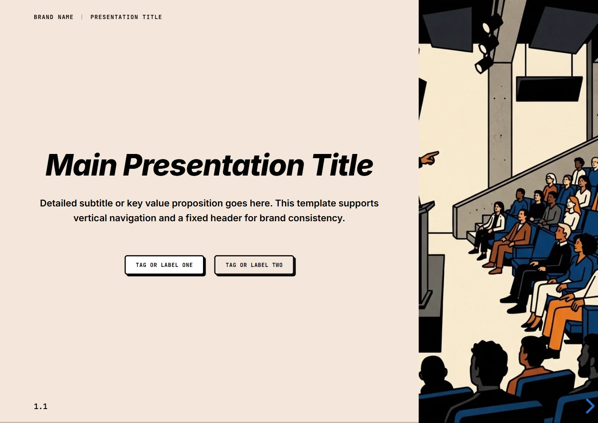

### Slide 2: Module Title
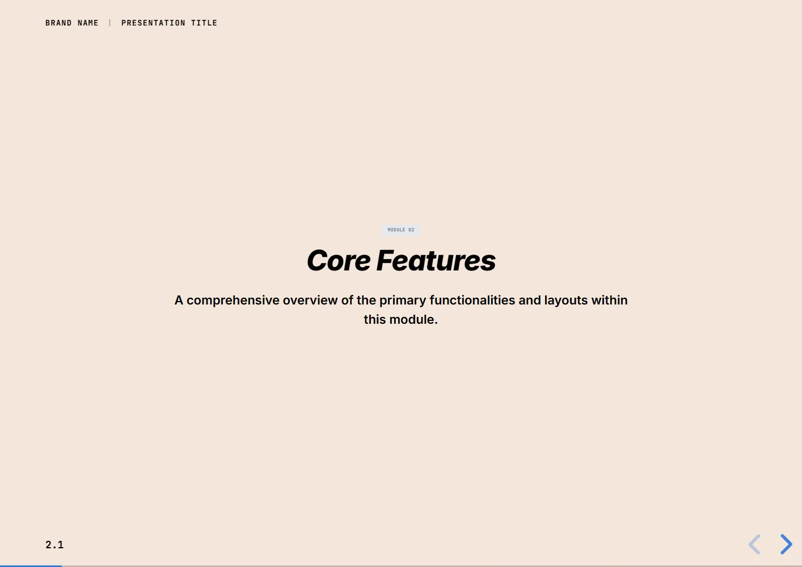

### Slide 3: Feature Overview Grid
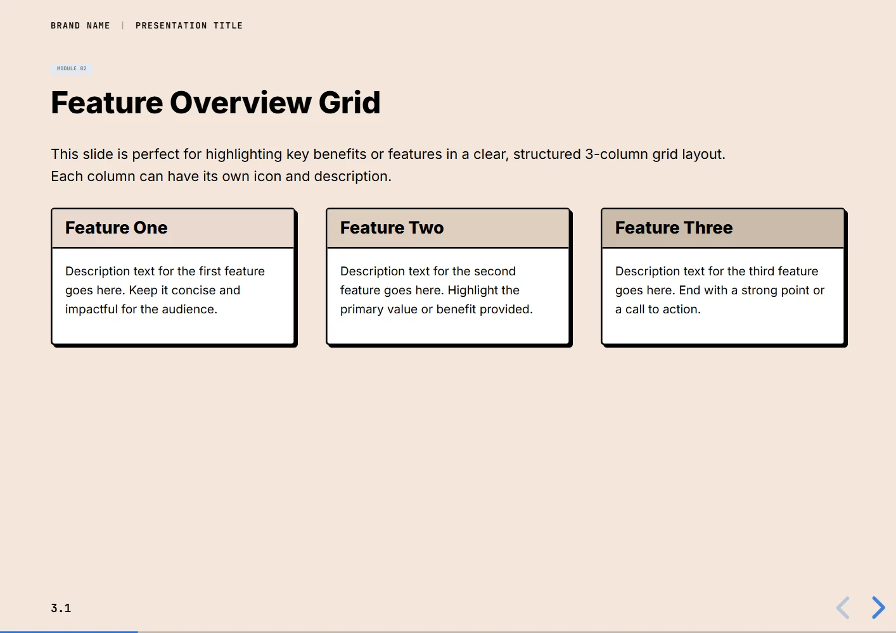

### Slide 4: Two-Column Cards
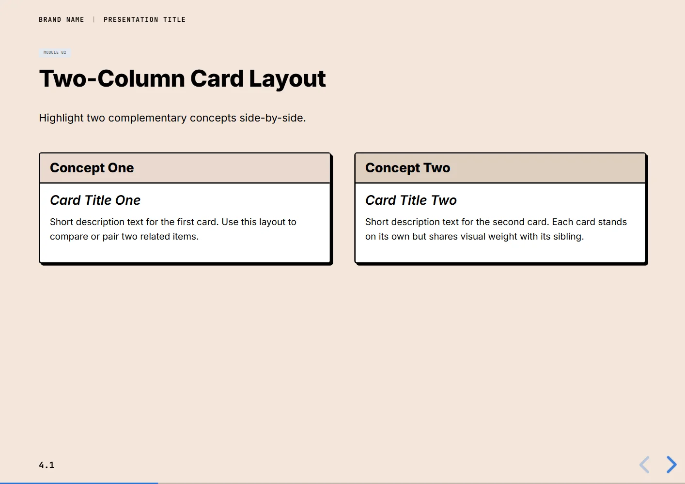

### Slide 5: Visual Context
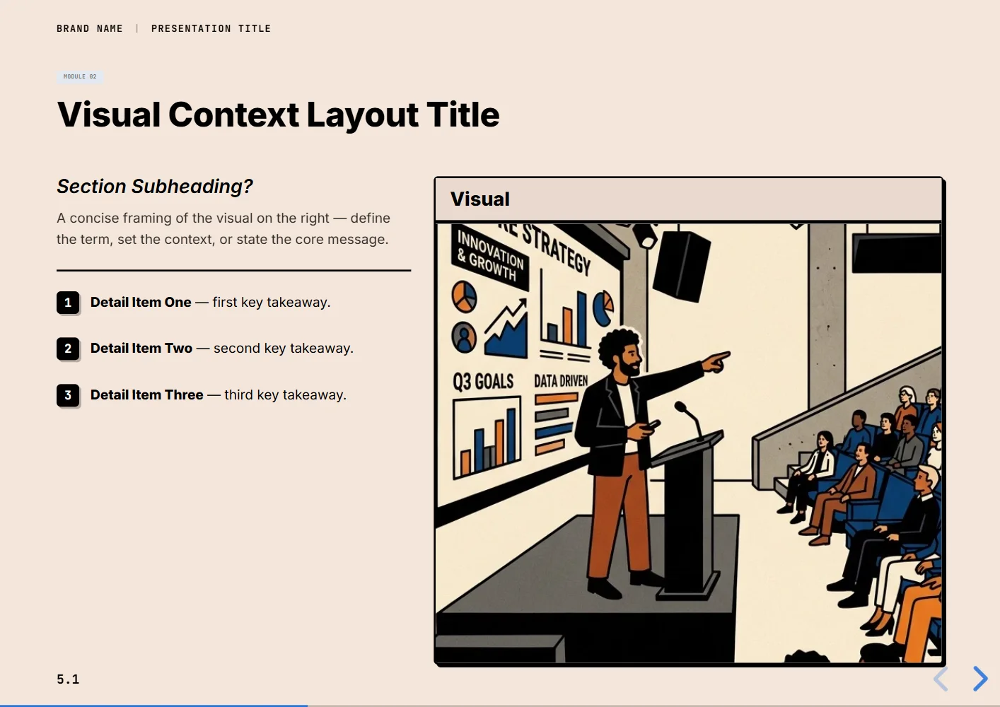

### Slide 6: Comparison Table
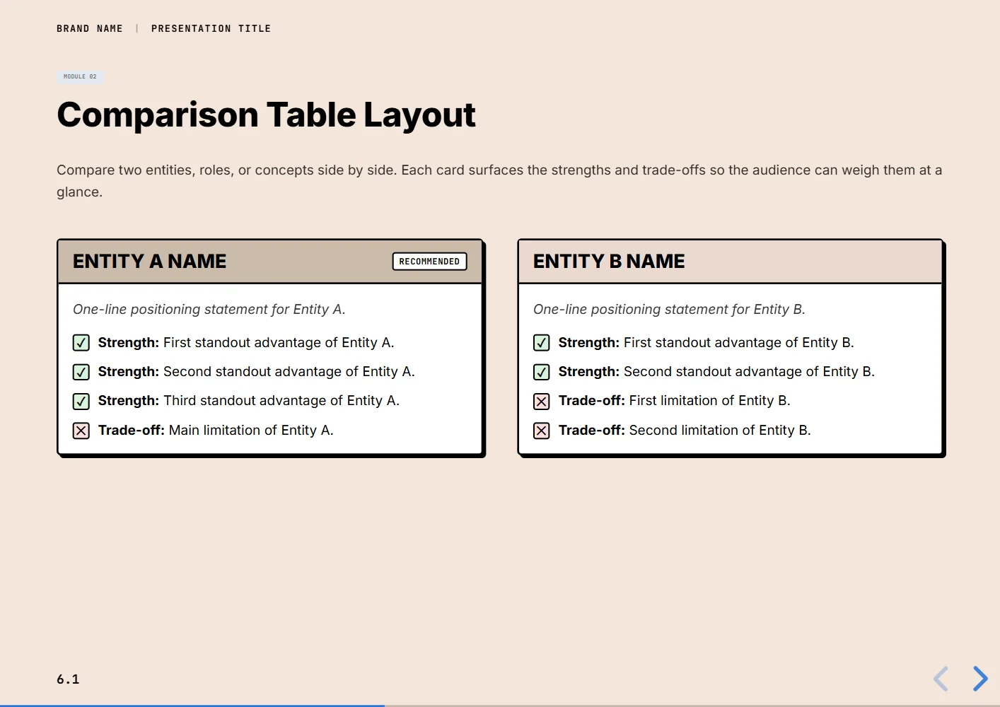

### Slide 7: Module Title With Links
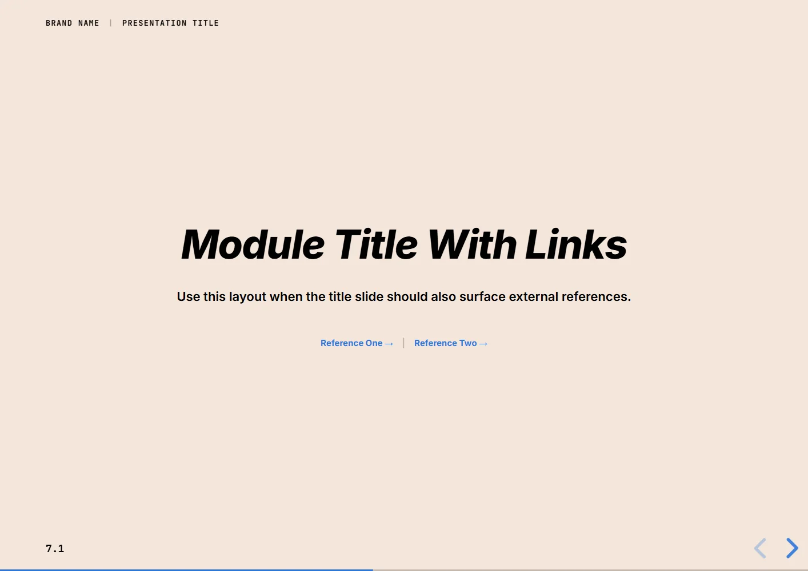

### Slide 8: Five-Item Grid
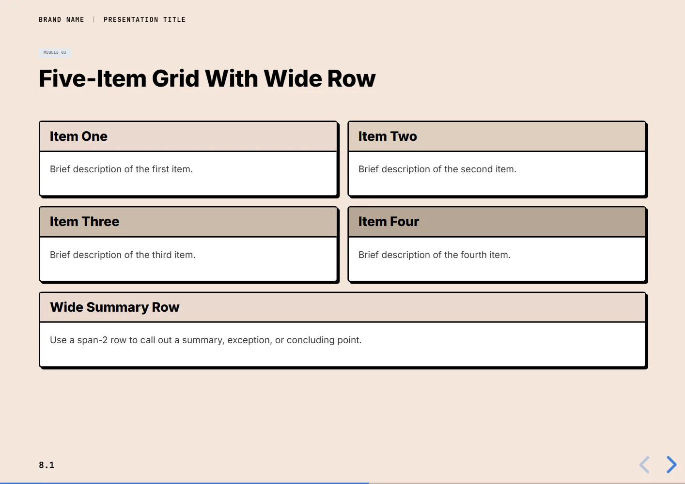

### Slide 9: Numbered Steps
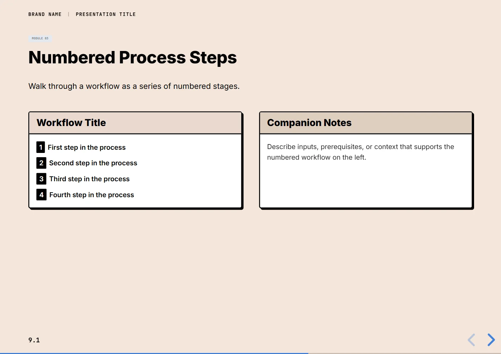

### Slide 10: Four-Column Comparison
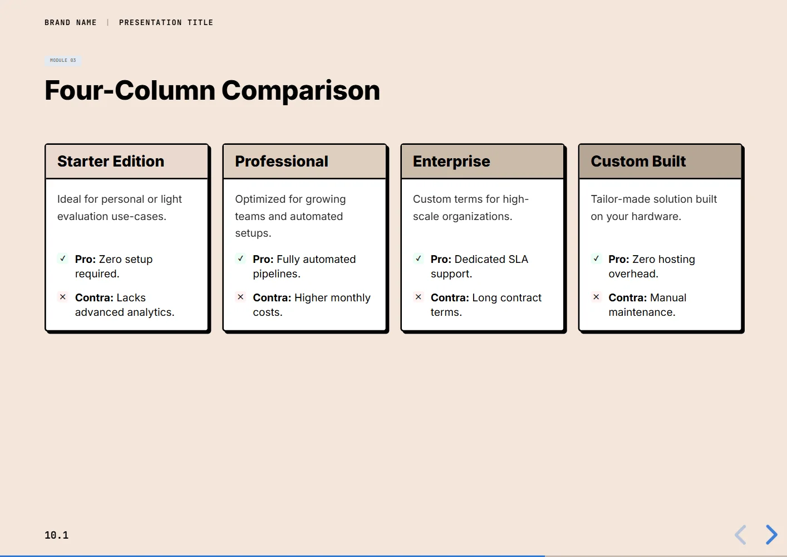

### Slide 11: Hands-On Steps
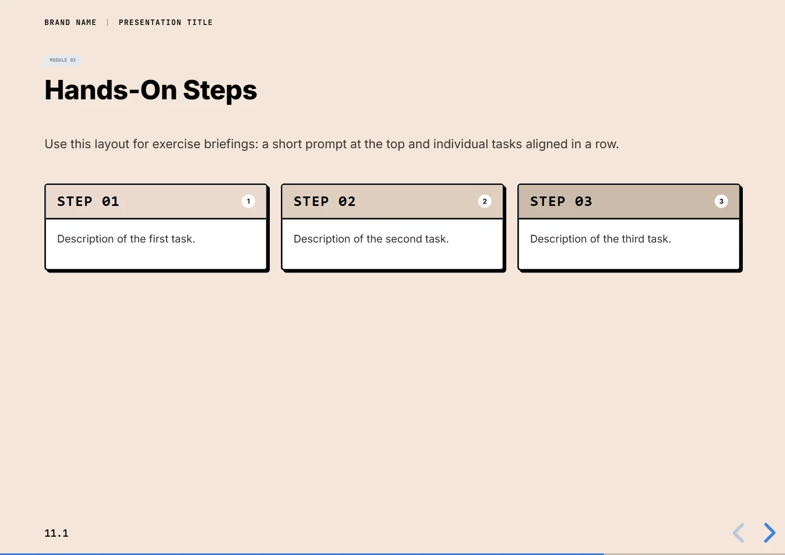

### Slide 12: Call to Action
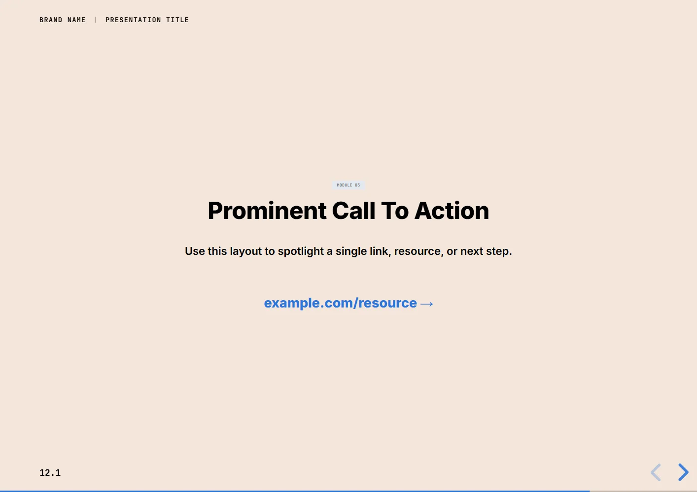

### Slide 13: Background Image
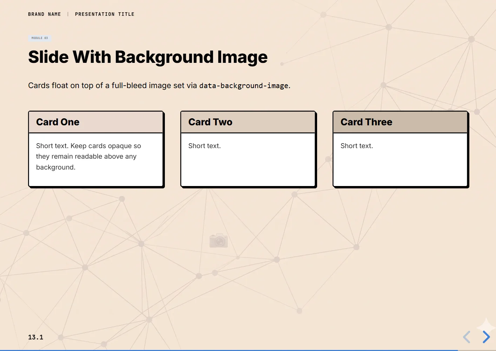

### Slide 14: Outro
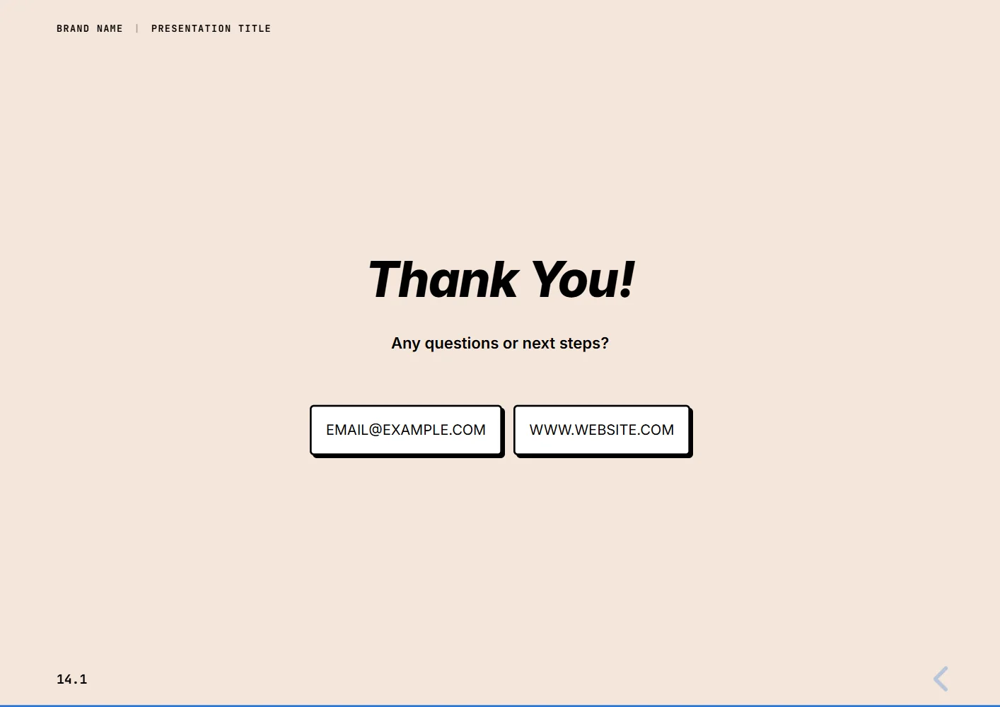

## License

This project is licensed under the GNU General Public License v3.0 License - see the [LICENSE](LICENSE) file for details.
