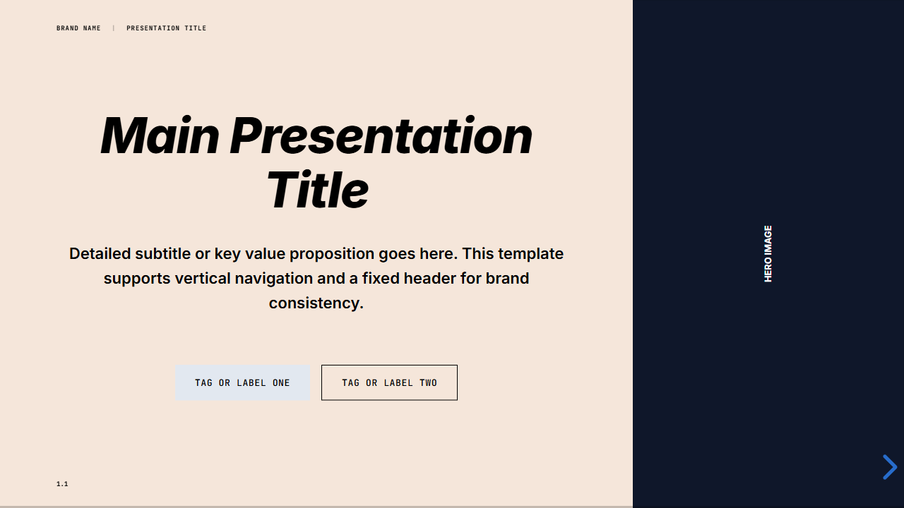
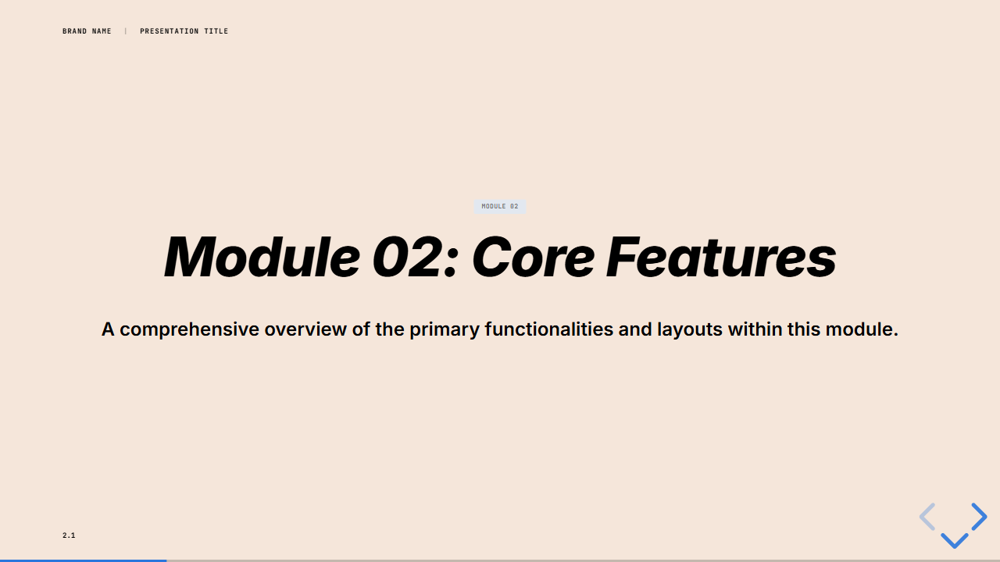
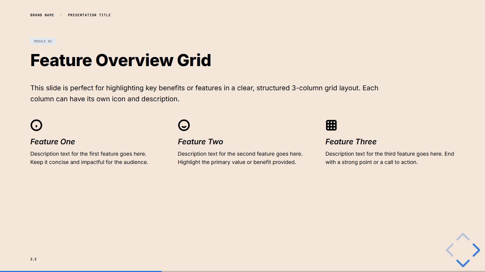
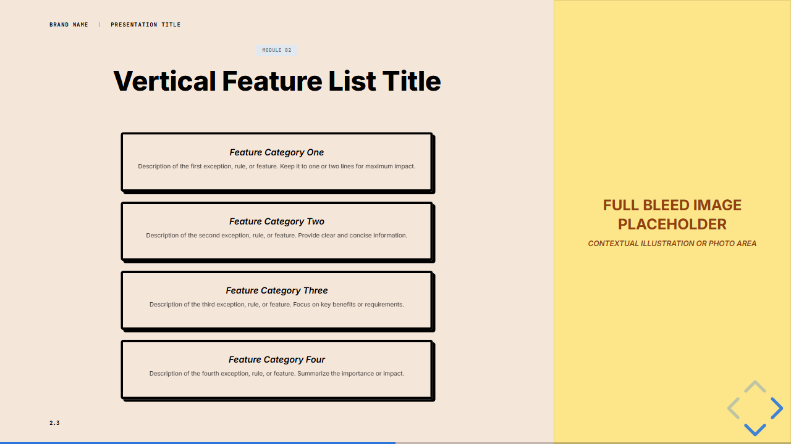
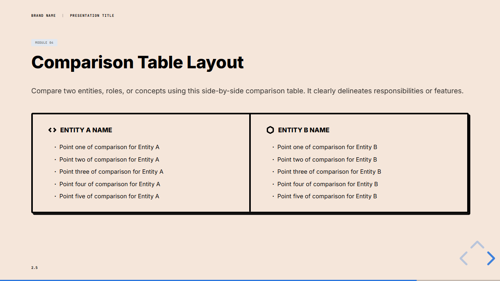
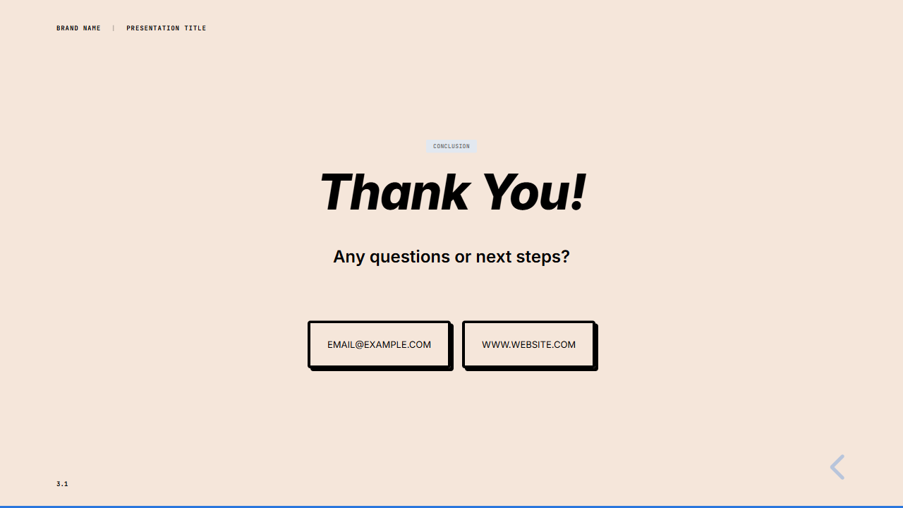

# Presentation Template

A professional, modern presentation template built with [reveal.js](https://revealjs.com/), [Vite](https://vitejs.dev/), and [Tailwind CSS](https://tailwindcss.com/). This template provides a sleek, brand-consistent layout for technical and corporate presentations.

## Features

- **Responsive Design**: Optimized for various screen sizes using reveal.js.
- **Brand Consistency**: Fixed header for brand name and presentation title across all slides.
- **Dynamic Slide Loading**: Slides are modularly stored in `slides/` and injected dynamically.
- **Rich Layouts**: Includes Hero, Feature Grid, Vertical List, Visual Context, and Comparison Table layouts.
- **Styling**: Leverages Tailwind CSS for utility classes and custom CSS for presentation-specific components.

## Getting Started

### Prerequisites

- [Node.js](https://nodejs.org/) (v18 or higher)
- npm (comes with Node.js)

### Installation

1. Clone the repository.
2. Install dependencies:
   ```bash
   npm install
   ```

### Development

Start the local development server:
```bash
npm run dev
```
Navigate to `http://localhost:5173/` to view the presentation.

### Production

Build for production:
```bash
npm run build
```

## Slide Previews

### Slide 1: Hero Slide


### Slide 2: Content Module Overview
#### 2.1: Module Title


#### 2.2: Feature Overview Grid


#### 2.3: Split Feature List


#### 2.5: Comparison Table Layout


### Slide 3: Conclusion Slide


## License

This project is licensed under the GNU General Public License v3.0 License - see the [LICENSE](LICENSE) file for details.
